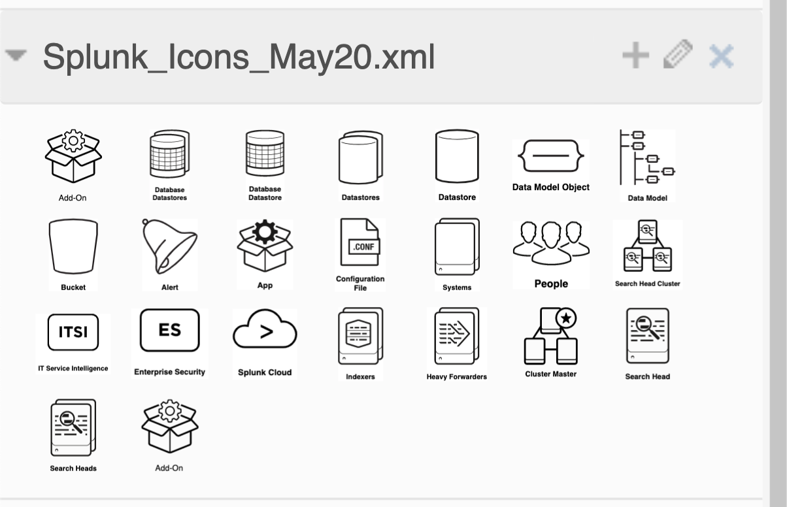

# splunk_drawio_icons. 
Draw.io Iconset for Splunk. Based on publically available images at [https://wiki.splunk.com/Community:Splunk_Visio_Stencil](https://web.archive.org/web/20220125073703/https://wiki.splunk.com/Community:Splunk_Visio_Stencil) / https://docs.splunk.com/images/d/d6/Splunk_Documentation_Icons_August2018_vssx.zip

# 22 Icons Included (Updated May 2020)  

- Add-On   
- Alert
- App
- Bucket
- Cluster Master
- Configuration File
- Database Datastore
- Database Datastores
- Datastore
- Datastores
- Data Model Object
- Data Model
- Enterprise Security
- Heavy Forwarders
- Indexers
- IT Service Intelligence
- People
- Search Head
- Search Heads
- Search Head Cluster (SHC)
- Splunk Cloud
- Systems

Style guide [https://wiki.splunk.com/images/e/e0/Splunk-Icon-Styleguide.pdf]

# How to  
1. Download the XML file from this repo
2. In Draw.io select:
> File -> Import From... -> Device...
Select the XML file you downloaded
